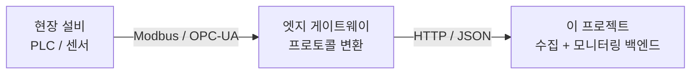
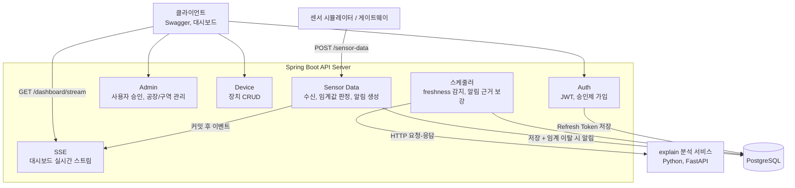
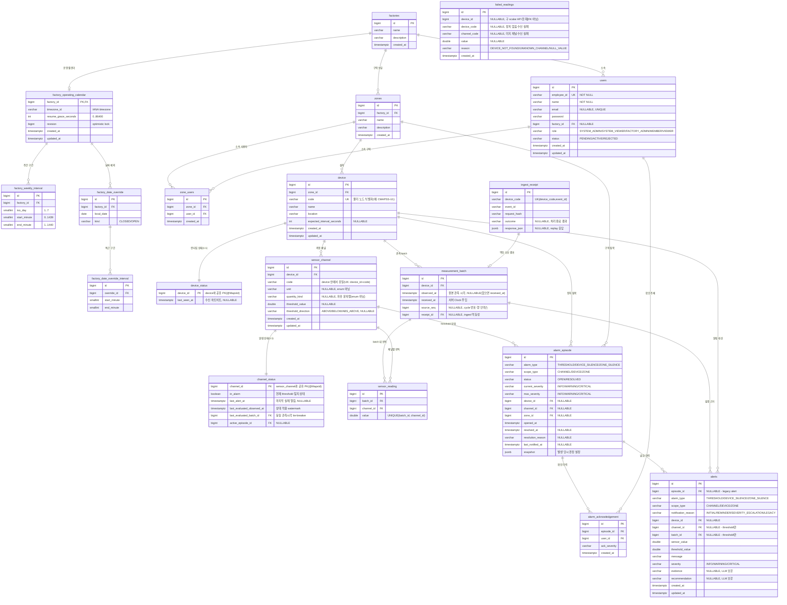

# Sensor Monitor

> 제조 설비 센서 데이터를 수집하고 이상 발생 시 근거와 함께 알림을 생성하는 센서 시계열 수집, 모니터링 백엔드

<br>


<br>

GitHub: https://github.com/YEONJI-P/sensor-monitor

<br>

---

## 목차

1. [프로젝트 소개](#1-프로젝트-소개)
2. [범위와 경계](#2-범위와-경계)
3. [기술 스택](#3-기술-스택)
4. [시스템 아키텍처](#4-시스템-아키텍처)
5. [ERD](#5-erd)
6. [API 명세](#6-api-명세)
7. [주요 기능](#7-주요-기능)
8. [확장 로드맵](#8-확장-로드맵)
9. [실행 방법](#9-실행-방법)
10. [설계 메모](#10-설계-메모)

---

## 1. 프로젝트 소개

제조 설비, 공장 환경에서 발생하는 센서 데이터를 수집하고, 임계값을 벗어난 이상 징후가 보이면 근거와 함께 알림을 생성하는 모니터링 백엔드입니다. 수집한 센서 시계열과 알림 이력은 영속 저장되어 사후 조회할 수 있습니다.

사번(employeeId) 기반의 승인제 회원 관리와 역할 기반 접근 제어(RBAC)를 제공합니다.

---

## 2. 범위와 경계

이 프로젝트는 게이트웨이가 HTTP/JSON으로 전달한 센서 데이터를 받아 저장하고 감시하는 백엔드입니다. 현장 프로토콜(Modbus, OPC-UA)의 수집과 변환은 범위 밖입니다.



실제 실시간 센서 대신, 저장된 센서 시계열을 시간 순으로 흘려보내 수신을 재현합니다.

---

## 3. 기술 스택

| 영역 | 기술 |
|---|---|
| Language | Java 17 |
| Framework | Spring Boot 3.x, Spring Security |
| Auth | JWT (JSON Web Token), Refresh Token 회전 |
| ORM | Spring Data JPA (Hibernate) |
| Database | PostgreSQL, Flyway |
| Realtime | Server-Sent Events (SSE) |
| AI Service | Python 3.11, FastAPI, uv |
| API Docs | Swagger (springdoc-openapi) |
| Test | JUnit5, Mockito, H2(부팅 스모크), Testcontainers(DB 계층), pytest |
| Container | Docker, Docker Compose |
| CI | GitHub Actions |

---

## 4. 시스템 아키텍처

센서 데이터 수신은 별도 메시지 버스 없이 동기 처리합니다. 수신 요청이 들어오면 한 트랜잭션 안에서 센서 데이터를 저장하고, 장치의 마지막 수신 시각을 갱신하고, 채널별 임계 방향(`ABOVE`/`BELOW`/`ABS_ABOVE`)의 이탈을 판정합니다. 현재 이상 상태는 `alarm_episode`, 사용자에게 보여 준 개별 발화 이력은 `alert`에 분리해 저장합니다. 저장과 이벤트는 트랜잭션 커밋 후 SSE로 대시보드에 전달됩니다.

주기 스케줄러 두 개가 수신 경로 밖에서 동작합니다. 하나는 기대 수신 주기의 2배를 넘긴 침묵 장치를 감지하고, 다른 하나는 생성된 알림의 당시 snapshot을 바탕으로 근거와 권고를 채우기 위해 별도 Python 분석 서비스(explain)를 HTTP로 호출합니다. explain 작업은 DB에서 claim한 뒤 HTTP를 트랜잭션 밖에서 수행하며 lease와 backoff로 재시도합니다. 이상 탐지는 규칙 기반이고, 설명과 진단만 LLM이 담당합니다.



---

## 5. ERD



---

## 6. API 명세

Swagger UI: `http://localhost:23100/swagger-ui/index.html` (컨테이너 데모는 `8080`)


### Auth

| Method | Endpoint | 설명 | 인증 |
|---|---|---|---|
| GET | `/auth/factories` | 가입 화면용 공장 선택 목록 (`id`, `name`) | 불필요 |
| POST | `/auth/register` | 공장 `factoryId`를 포함한 가입 신청 (필수, status=PENDING) | 불필요 |
| POST | `/auth/login` | 로그인, ACTIVE 상태만 허용 | 불필요 |
| POST | `/auth/refresh` | Access Token 재발급 | 불필요 |

### Admin (FACTORY_ADMIN 이상)

| Method | Endpoint | 설명 | 인증 |
|---|---|---|---|
| GET | `/admin/users` | 사용자 목록 (FACTORY_ADMIN은 소속 공장만) | JWT |
| GET | `/admin/users/pending` | 승인 대기 목록 (FACTORY_ADMIN은 소속 공장만) | JWT |
| PATCH | `/admin/users/{id}/approve` | 가입 승인 — ACTIVE 전환 + 공장·역할·구역 배정 (body: `role`, `factoryId`, `zoneIds`) | JWT |
| PATCH | `/admin/users/{id}/reject` | 가입 반려, REJECTED 전환 | JWT |
| GET, POST | `/admin/factories` | 공장 조회, 등록 (SYSTEM_ADMIN) | JWT |
| PUT, DELETE | `/admin/factories/{id}` | 공장 수정, 삭제 (SYSTEM_ADMIN) | JWT |
| GET, POST | `/admin/zones` | 구역 조회, 등록 | JWT |
| PUT, DELETE | `/admin/zones/{id}` | 구역 수정, 삭제 | JWT |
| POST | `/admin/zones/{id}/users` | 구역에 사용자 추가 | JWT |
| DELETE | `/admin/zones/{id}/users/{userId}` | 구역에서 사용자 제거 | JWT |
| GET | `/admin/factory-calendars` | 접근 가능한 공장 일정 요약 (SYSTEM_ADMIN 전체, FACTORY_ADMIN 자기 공장) | JWT |
| GET | `/admin/factory-calendars/{factoryId}` | 공장 운영 캘린더 상세 | JWT |
| PUT | `/admin/factory-calendars/{factoryId}` | timezone·재개 유예·주간표·날짜 예외를 revision 기반으로 원자적 전체 교체 | JWT |

> 운영 캘린더 PUT의 구간은 분 단위 `[start, end)`이며 종료에만 `24:00`을 쓸 수 있습니다. 겹치거나 맞닿은 구간과 자정을 넘는 한 구간은 400으로 거부하므로 야간 교대는 날짜별 두 구간으로 나눕니다. `CLOSED`는 종일 휴무이고 `OPEN`은 해당 날짜의 주간표를 완전히 대체합니다. stale `revision`은 409이며 자동 덮어쓰지 않습니다.

### Device (조회는 인증, 쓰기는 SYSTEM_ADMIN, FACTORY_ADMIN, MEMBER)

| Method | Endpoint | 설명 | 인증 |
|---|---|---|---|
| GET | `/devices` | 내 장치 목록 | JWT |
| POST | `/devices` | 장치 등록 | JWT |
| PUT | `/devices/{id}` | 장치 수정 | JWT |
| DELETE | `/devices/{id}` | 장치 삭제 | JWT |
| GET | `/zones` | 역할 범위 내 구역 조회 | JWT |

### Sensor Data

| Method | Endpoint | 설명 | 인증 |
|---|---|---|---|
| POST | `/sensor-data` | 배치 수신 (게이트웨이·시뮬레이터 → 서버). body: `deviceCode`, `eventId?`, `observedAt?`, `sourceSeq?`, `measurements`(채널 code→value map) | `X-Ingest-Key` |

> 한 물리 노드(`deviceCode`)의 한 관측 시점(batch) 값 묶음을 한 요청으로 받습니다. 미지 채널·null 값은 예외 없이 부분 실패로 처리해 응답 `rejected`에 채널 코드와 사유(`UNKNOWN_CHANNEL`/`NULL_VALUE`)를 담고, 나머지 채널은 정상 저장합니다. 응답은 기존 필드와 함께 상태에 실제 적용된 판독 수를 반환합니다. 장치 없음은 404(batch 미생성), 요청 채널 전부가 미지·무효하거나 `observedAt`이 서버 수신 시각보다 5분 넘게 미래이면 422(batch·heartbeat 미생성)입니다. 늦게 도착한 과거 판독은 이력과 차트에는 저장하지만 현재 episode와 카드 상태를 되돌리지 않습니다.

> `eventId`는 선택적인 producer 멱등성 키이며 `(deviceCode,eventId)` 범위에서만 유일합니다. 같은 payload의 재시도는 저장된 HTTP 결과를 그대로 반환하고 SSE를 다시 보내지 않으며, 같은 키를 다른 payload에 재사용하면 409를 반환합니다. `sourceSeq`는 순서 힌트일 뿐 unique key가 아닙니다.

> 수신 경로는 사람용 JWT와 분리한 공유 키를 사용합니다. backend와 simulator에 같은 `INGEST_API_KEY`를 설정하면 simulator가 `X-Ingest-Key` 헤더로 전송합니다. 키가 없으면 두 서비스 모두 시작 단계에서 실패하고, 헤더가 없거나 다르면 `401`과 `UNAUTHORIZED` 응답을 반환합니다.

### Channel

| Method | Endpoint | 설명 | 인증 |
|---|---|---|---|
| GET | `/channels` | 내 접근 범위의 채널 목록 (대시보드 채널 카드·관리 콘솔 소스) | JWT |
| GET | `/channels/{id}/readings?limit=` | 채널별 최근 판독 (`observed_at desc`, 기본·상한 500건, 서버 순간 판정 `anomaly`) | JWT |
| POST | `/devices/{deviceId}/channels` | 채널 등록 | JWT |
| PUT | `/channels/{id}` | 채널 수정 (임계값·임계 방향 등) | JWT |

### Alert

| Method | Endpoint | 설명 | 인증 |
|---|---|---|---|
| GET | `/alerts` | 전체 알림 조회 (페이지네이션, `?page=&size=&sort=&deviceId=`; `deviceId` 선택) | JWT |
| GET | `/alerts/channel/{channelId}` | 채널별 알림 조회 | JWT |
| GET | `/alerts/recent?channelId=&limit=` | 채널별 최근 알림 (대시보드) | JWT |
| GET | `/alerts/daily-count?channelId=&days=` | 채널별 일자별 알림 수 (대시보드) | JWT |
| GET | `/alarm-episodes` | 접근 범위의 episode 조회 (`status`, `type`, `scopeType`, `deviceId`, `channelId`, `zoneId` 선택 필터 + 페이지네이션) | JWT |
| GET | `/alarm-episodes/{id}` | episode 상태·발생/해제 시각·snapshot·최근 확인 조회 | JWT |
| POST | `/alarm-episodes/{id}/ack` | 열린 episode 확인 처리 (`SYSTEM_ADMIN`, 범위 내 `FACTORY_ADMIN`·`MEMBER`; 동일 통지에 멱등) | JWT |

> `alarm_episode`는 현재 사건의 시작·유지·해제를 나타내는 정본이고, `alert`는 `INITIAL`·`REMINDER`·`SEVERITY_ESCALATION`처럼 실제로 발화한 notification 이력입니다. 기존 `/alerts` 필드는 유지하며 `type`·`scope`·`episodeId`·`notificationReason`을 additive하게 반환합니다. episode의 현재 상태와 해제 사유는 `/alarm-episodes`에서 조회합니다. `/alerts/daily-count`는 episode 수가 아니라 실제 notification 수입니다.

### 실시간 스트림 (SSE)

| Method | Endpoint | 설명 | 인증 |
|---|---|---|---|
| GET | `/dashboard/stream?token=` | 접근 범위 내 센서, 알림 이벤트 실시간 스트림 | 쿼리 토큰 |
| GET | `/dashboard/overview` | 접근 가능한 공장·구역·장치와 채널 최신 상태를 한 번에 조회 | JWT |

> EventSource가 헤더를 못 실어 Access Token을 쿼리로 받습니다. 구독 이벤트는 `AccessControlService`가 계산한 장치·구역 범위로 필터링됩니다. `sensor-data` 이벤트는 batch 단위 판독과 `stateApplied`를, `alert` 이벤트는 실제 notification을, `alarm-episode` 이벤트는 `OPEN`·`RESOLVED`·`ACK`·`ENRICHED` 상태 변경을 전달합니다. 모두 DB 트랜잭션 커밋 후 전송하므로 rollback된 유령 이벤트는 없습니다. 연결이 닫히면 refresh token으로 access token을 갱신해 재구독하고, 30초 polling으로 인프로세스 SSE 유실을 보정합니다.

> overview의 freshness는 `NOT_MONITORED`(기대 주기 미설정), `PLANNED_OFFLINE`(운영시간 밖), `RESUMING`(운영 재개 후 첫 수신 유예), `NEVER_SEEN`, `ONLINE`, `STALE` 여섯 단계입니다. 최근 데이터가 실제로 들어오면 비운영시간이나 유예 중에도 `ONLINE`이며, 그 밖에는 마지막 수신 후 기대 주기의 2배까지 `ONLINE`, 이후 `STALE`입니다. 요약 분모와 freshness 경고 lamp는 미감시·계획 비가동·재개 대기 장치를 제외합니다.

### explain 분석 서비스 (Python, 로컬 `http://localhost:23200` · 컨테이너 데모 `8000`)

Spring이 스케줄러에서 HTTP로 호출하는 별도 서비스입니다. 탐지는 Spring의 규칙이 담당하고, 이 서비스는 설명과 진단만 생성합니다.

| Method | Endpoint | 설명 |
|---|---|---|
| POST | `/explain/anomaly` | 알림 근거(evidence)와 권고(recommendation) 생성 |
| POST | `/explain/freshness` | 장치 침묵 원인 진단 |

> LLM provider는 인터페이스로 분리돼 있습니다. 기본값은 키가 필요 없는 `echo`이고, 환경변수로 `gemini`로 교체할 수 있습니다.

---

## 7. 주요 기능

실시간 대시보드 — SSE로 센서값이 실시간 갱신되고, 임계 이탈 알림에는 LLM(explain 서비스)이 생성한 근거·권고가 붙습니다. 장치 상세의 최근 알림은 기본 5건을 한 줄로 보여주고, 한 건씩 근거·권고를 펼치거나 최근 20건 전체를 내부 스크롤로 확인할 수 있습니다.


관리 콘솔은 장치 목록과 선택 장치의 상세·하위 채널을 한 화면에서 관리합니다. 구역 필터가 선택돼 있으면 장치 등록 구역의 기본값으로 이어지며, 채널 임계값과 방향은 둘 다 입력하거나 둘 다 비우는 한 쌍으로 관리합니다.


### 승인제 사용자 관리와 접근 제어

- 사번(employeeId)과 필수 공장 선택 기반 가입 신청, 가입 즉시 해당 공장 소속의 `PENDING` 상태로 저장
- 가입 화면의 공장 선택지는 무인증 `GET /auth/factories`가 이름순으로 제공하며, 존재하지 않는 `factoryId`는 가입 단계에서 거부
- `FACTORY_ADMIN` 이상의 관리자가 승인 또는 반려(`REJECTED`) 처리. 승인 시 `ACTIVE` 전환과 함께 공장·역할 부여, 소속 구역 배정을 한 트랜잭션에서 수행
- `SYSTEM_ADMIN`은 신청 공장을 승인 화면에서 교정할 수 있고 선택한 공장 소속 구역만 배정 가능. `FACTORY_ADMIN`은 대상의 자기 공장이 고정되며, 자기 공장 사용자만 조회·승인하고 자기 역할보다 낮은 역할만 부여
- `PENDING`, `REJECTED` 상태에서 로그인 시 `DisabledException`으로 차단
- 역할 기반 접근 제어

  | 역할 | 범위 |
  |---|---|
  | `SYSTEM_ADMIN` | 전체 공장, 장치 |
  | `SYSTEM_VIEWER` | 전체 운영 데이터와 관리 설정 조회(변경 불가) |
  | `FACTORY_ADMIN` | 소속 공장의 telemetry 조회와 구역, 장치, 사용자 관리 |
  | `MEMBER` | 소속 구역 읽기, 쓰기 (장치 관리) |
  | `VIEWER` | 소속 구역 읽기 전용 (장치 변경 불가) |

- 공장(Factory), 구역(Zone) 계층과 구역 소속 관계로 접근 범위를 계산하는 `AccessControlService`
- prod의 공개 데모 토폴로지는 Flyway V3·V4가 자동 투입하고 V5가 채널 임계값·방향 계약을 강제합니다. local의 계정 포함 데모 데이터는 `services/simulator/seed.sql`로 별도 투입

### 센서 데이터 수신과 알림

- `POST /sensor-data` 수신 시 한 트랜잭션에서 batch/readings 저장, 장치 heartbeat 갱신, 임계값 판정, episode 전이와 필요한 notification 생성을 수행
- **트리거:** 현재 episode가 없는 채널의 최신 판독이 `ABOVE`·`BELOW`·`ABS_ABOVE` 임계값을 이탈하면 즉시 `THRESHOLD/CHANNEL` episode를 `OPEN`합니다. 임계 대비 이탈 폭이 10%를 넘으면 `CRITICAL`, 아니면 `WARNING`입니다
- **유지:** 이탈이 계속되거나 0.1% strict hysteresis band 안에 있으면 같은 episode를 유지합니다. notification cooldown은 마지막 실제 발화 사이 5분이며 탐지 상태와 `inAlarm`은 억제하지 않습니다. 5분이 지난 뒤에도 이탈이 지속되면 다음 최신 판독에서 `REMINDER`, `WARNING → CRITICAL` 상승이면 즉시 `SEVERITY_ESCALATION`을 만들고, 현재 severity의 최신 notification을 확인한 episode는 같은 severity reminder를 억제합니다
- **해제:** 방향별 release 경계를 완전히 통과한 최신 판독에서 `RECOVERED`로 종료합니다. threshold 값·방향을 변경하거나 제거하면 `CONFIG_CHANGED`로 종료하며, 이름·단위 같은 표시 설정만 바뀌면 발생 당시 snapshot은 그대로 유지합니다. 해제 자체는 `alert` 행을 추가하지 않고 episode와 `alarm-episode` SSE만 갱신합니다
- **순서:** 판독 이력은 늦게 와도 저장하지만 채널 watermark보다 과거인 관측은 live state에 적용하지 않습니다. `observedAt`이 서버 수신 시각보다 5분 넘게 미래인 요청은 전체를 422로 거부합니다
- `eventId`를 보내면 `(deviceCode,eventId)` 멱등 재시도를 지원하고, 같은 결과를 재생할 때 batch·alert·SSE를 중복 생성하지 않습니다
- 마지막 수신 시각은 `device_status`, 채널별 현재 알람 여부·마지막 실제 알림 시각·활성 episode는 `channel_status`에서 설정과 분리해 관리
- 별도 메시지 버스 없이 동기 처리 (설계 근거는 아래 설계 메모 참고)
- 이상 판정은 `AnomalyDetector` 전략 인터페이스로 분리(현재 `ThresholdDetector`), 판정 로직 교체 가능
- 검증 실패, 미등록 장치 요청은 조용히 버리지 않고 `failed_readings`에 사유와 함께 적재
- 알림은 severity(INFO/WARNING/CRITICAL)와 근거(evidence), 권고(recommendation) 필드를 가지며, explain 보강은 발생 당시 episode snapshot과 최근 판독을 사용합니다. 채널 설정이 나중에 바뀌어도 과거 알림의 판정 근거는 바뀌지 않습니다

### 장치 freshness 감지

- 장치 설정에 기대 수신 주기(`expectedIntervalSeconds`)를 두고, 마지막 수신 시각(`lastSeenAt`)은 런타임 상태라 `device_status`에 두어 수신마다 갱신
- 대시보드와 scheduler가 같은 정책을 사용해 마지막 수신 뒤 기대 주기의 2배까지 `ONLINE`, 그 이후 `STALE`로 판정
- **트리거:** 운영 중이며 한 번 이상 수신한 감시 대상 장치가 `STALE`이면 장치 episode를 엽니다. 같은 구역에서 eligible 장치가 2대 이상이고 모두 `STALE`이면 개별 episode 대신 `ZONE_SILENCE` 한 건을 `CRITICAL`로 엽니다. 아직 한 번도 수신하지 않은 `NEVER_SEEN`은 화면에만 표시하고 episode를 만들지 않습니다
- **유지:** 같은 장치·구역의 침묵이 이어지면 영속 episode를 재사용합니다. zone 행과 장치 상태를 DB에서 직렬화하므로 scheduler 재시작이나 여러 인스턴스의 동시 tick에도 같은 episode와 초기 notification이 중복되지 않습니다. 5분 reminder, acknowledgement 억제, severity 상승 규칙은 threshold와 같습니다
- **해제/재분류:** 수신 재개는 `RECOVERED`, 운영시간 밖은 `PLANNED_OFFLINE`, 재개 유예는 `RESUME_GRACE`, 감시 해제는 `MONITORING_DISABLED`로 종료합니다. 전체 침묵과 부분 침묵 사이가 바뀌면 기존 zone/장치 episode를 `RECLASSIFIED`로 닫고 새 scope episode를 엽니다
- 날짜 예외가 주간표보다 우선하고 `OPEN`은 해당 날짜를 완전히 대체. 캘린더가 없는 공장은 기존처럼 24시간 감시하여 설정 누락이 장애를 숨기지 않음

### 공장 운영 캘린더

- Factory 하위의 독립 설정 aggregate로 timezone, 재개 유예, 요일별 복수 구간, `CLOSED`/`OPEN` 날짜 예외를 관리
- `SYSTEM_ADMIN`은 모든 공장, `FACTORY_ADMIN`은 자기 공장만 관리 콘솔의 `운영 캘린더` 탭에서 조회·수정
- 저장은 전체 aggregate 원자적 교체이며 revision 충돌 시 409. 미저장 이동 경고, 저장 중 잠금, 충돌 후 명시적 새로고침 UX 제공
- 캘린더는 freshness 알림과 대시보드 표시만 제어. 센서 수신, 채널 임계 알림, replay/synthetic simulator 실행은 운영시간 밖에도 독립적으로 유지

### LLM 기반 이상 설명 (explain 서비스)

- 별도 Python/FastAPI 서비스가 알림 근거, 권고와 침묵 원인 진단을 생성
- 탐지는 규칙, 설명과 진단만 LLM이 담당
- provider를 인터페이스로 분리해 LLM 교체 가능(기본 `echo`, `gemini` 선택)

### 인증

- JWT 기반 stateless 인증, Refresh Token 은 PostgreSQL 에 저장
- Refresh Token 회전, 불일치 시 저장 토큰을 삭제해 강제 로그아웃 처리
- Access, Refresh 토큰에 `type` 클레임을 두어 Refresh 토큰으로는 API에 접근 불가

### 센서 시뮬레이터 (`services/simulator/simulator.py`)

- 실제 센서처럼 서버 외부에서 `POST /sensor-data`를 직접 호출
- `replay`: 공개 실측 시계열(C-MAPSS 엔진, CNC 밀링)을 시간 순으로 재생 — 원본 한 행이 물리 device 하나의 관측 batch 하나(`measurements` 채널 code→value map)로 요청 1건이 됩니다
- `synthetic`: 정상 랜덤워크에 간헐적 임계 초과·회복 구간을 섞어 무제한 생성. 운영 요일·시간대 밖에는 프로세스를 종료하지 않고 전송만 대기합니다
- 대상 device(`deviceCode`), 전송 간격, 전송 수, 난수 seed와 운영시간을 CLI 인자로 지정

### 실시간 대시보드

- 공장·구역별 장치 카드 overview에서 freshness, 마지막 수신, 알람 유지 중 채널 수를 한눈에 표시
- 장치 상세의 채널 카드로 그래프 대상을 선택하고, 1·5·15분 범위의 최대 300개 시계열 점과 실제 저장 알림 삼각형 marker를 함께 확인
- SSE(`/dashboard/stream`) batch 한 건으로 같은 장치의 여러 채널을 함께 갱신하고, 30초 polling으로 상태를 재동기화
- 관리 콘솔의 장치 탭은 구역 filter·장치 목록과 선택 장치의 상세·하위 채널을 한 master-detail 화면에서 관리. 선택 구역은 장치 등록 기본값이며 채널 임계값·방향은 한 쌍으로 저장

---

## 8. 확장 로드맵

### 완료

- JWT 인증, 인가, 사번 기반 로그인, 승인제 가입
- 역할 기반 접근 제어, 전체 시스템·공장·구역 계층 접근 제어
- 가입 승인 워크플로 (역할 부여 + 구역 배정, FACTORY_ADMIN 소속 공장 스코핑)
- 동기 센서 수신 파이프라인 (수신, 저장, 임계값 판정, 알림)
- 이상 판정 로직 전략화 (`AnomalyDetector` 인터페이스로 분리)
- 알림 스키마 확장 (severity, 근거, 권고 필드)와 실패 수신 적재
- 장치 freshness 감지 (구역 코호트 판정으로 오탐 억제, 침묵 원인 explain 진단)
- SSE 기반 실시간 대시보드 (접근 범위 스코핑)
- LLM 기반 이상 근거, 원인 진단 (Python 분석 서비스 HTTP 연동)
- Gemini provider 실호출 (`gemini-3.1-flash-lite`, `google-genai`)
- 실측 공개 센서 시계열(C-MAPSS 엔진, CNC 밀링) 리플레이로 시뮬레이터 데이터 교체
- 운영시간을 반영한 무제한 합성 데이터 스트림과 Compose live 프로파일
- Refresh Token 저장·회전 (PostgreSQL)
- 공장별 운영 캘린더 기반 freshness 억제와 관리 UI

### 향후

- MQTT 수신 경로 도입 (엣지 게이트웨이와의 표준 연동)
- 대용량 시계열 저장소(TimescaleDB) 검토

---

## 9. 실행 방법

### 사전 요구사항

- Java 17
- 컨테이너 실행 시 Docker와 Docker Compose

독립 풀 데모는 이 저장소의 `docker-compose.yml` 하나로 실행합니다(원커맨드는 `make demo`). 직접 개발 실행은 별도 Compose가 아닙니다. GCP VM/prod 배포는 이 저장소가 아니라 bugi-server-infra가 담당합니다.

| 경로 | 파일 | PostgreSQL | 용도 |
|---|---|---|---|
| 독립 풀 데모 | `docker-compose.yml` | 전용 컨테이너·volume 포함 | 로컬 통합 실행, 평가자 데모 |

### 로컬 실행 (공용 Postgres + bootRun)

일상 개발용. 공용 Postgres 를 쓰고 backend 만 로컬에서 띄운다.

```bash
git clone https://github.com/YEONJI-P/sensor-monitor.git
cd sensor-monitor

# 공용 PostgreSQL 준비 — DB·사용자 sensor_monitor 가 실행 중이어야 함
# (앱 기본값이 jdbc:postgresql://localhost:5432/sensor_monitor 를 가리킴)

# JWT 서명 키 설정, 기본값이 없어 미설정 시 부팅 실패 (셸 export 또는 IDE 실행 구성)
export JWT_SECRET=$(head -c 48 /dev/urandom | base64)

# 애플리케이션 실행 (Spring은 services/backend/)
cd services/backend
./gradlew bootRun

# (선택) explain은 services/explain/README.md에 따라 별도 실행
```

> 공용 Postgres 가 기본 접속정보와 다르면 `DB_URL`·`DB_USERNAME`·`DB_PASSWORD` 를 셸 env 로 재정의합니다. Spring 은 `.env` 를 자동 로드하지 않으므로 위 값은 셸/IDE 에 직접 주입합니다.

### 독립 풀 데모 (`docker-compose.yml`)

평가자·로컬 통합 확인용입니다. postgres + backend + explain을 함께 기동하며 외부 DB가 필요 없습니다. backend가 local 프로파일로 스키마를 만들지만 `seed.sql`은 자동 실행되지 않으므로, 기동이 끝난 뒤 아래 명령으로 계정과 데모 토폴로지를 수동 적재합니다.

```bash
# backend 설정 준비. JWT_SECRET은 실행 전에 반드시 교체
cp services/backend/.env.example services/backend/.env

# (선택) Gemini provider를 사용할 때만 준비
# cp services/explain/.env.example services/explain/.env

docker compose up --build -d  # postgres + backend + explain

# 초기 데이터(계정/장치/임계값) 수동 적재 — docker compose up만으로는 실행되지 않음
docker compose exec -T postgres psql -U sensor_monitor -d sensor_monitor < services/simulator/seed.sql

# (선택) 공개 실측 데이터 리플레이. command를 덧붙이지 않아 내부 backend 주소를 유지
bash services/simulator/data/download.sh
docker compose --profile replay run --rm simulator-replay

# (선택) 평일 08:00~18:00, 10초 간격 합성 데이터 상시 스트림
docker compose --profile live up -d simulator-live
```

> 컨테이너 postgres는 호스트 `5433`, backend는 `8080`, explain은 `8000`에 노출됩니다. backend는 내부 네트워크의 `postgres:5432`를 사용하므로 서비스 env의 `DB_*` 값보다 Compose 토폴로지 값이 우선합니다. 샘플 계정은 위 수동 seed 명령으로 생성합니다. `docker compose down`은 volume을 유지하고, `down -v`는 데모 DB를 삭제하므로 데이터 삭제 의도가 있을 때만 사용합니다.

### GCP VM / prod 배포

GCP VM 배포는 **bugi-server-infra**가 소유합니다. Compose·nginx 라우팅·backend/explain 이미지 SHA pin·ingest 공유 키·운영 관리자 bootstrap·배포 자동화를 그쪽에서 관리합니다. 이 저장소는 backend·explain 운영 이미지와 Flyway 스키마·기준 토폴로지를 제공하고, prod 적용 계약(공개 origin·감시 URL·ingest 인증·이미지 배포 경계)은 bugi-server-infra `CONTRACT.md`를 따릅니다.

simulator는 prod 서비스나 GHCR 배포 이미지로 관리하지 않고 로컬 PC에서 소스로 실행합니다. GCP VM의 public reverse proxy는 HTTPS `POST /sensor-data`만 backend로 전달하고 backend는 기존 `X-Ingest-Key`를 검증합니다. DB·explain 포트와 ingest 키는 공개하지 않으며, 외부 ingest에 대한 TLS·method 제한·rate limit·요청 크기 제한은 bugi-server-infra가 소유합니다.

### 테스트 실행

```bash
# backend
cd services/backend
./gradlew test

# simulator
cd ../simulator
python -m unittest -v test_simulator.py

# 프론트 운영 캘린더 순수 validation
cd ../..
node services/backend/src/test/js/calendar-validation.test.js
```

> 테스트는 세 갈래입니다.
> - **컨텍스트 부팅 스모크**(`contextLoads`)는 인메모리 H2 로 동작해 별도 인프라 없이 실행됩니다(엔티티 매핑·설정 오류를 싸게 잡는 용도이며, DB 계층은 검증하지 않습니다). 설정은 `services/backend/src/test/resources/application.yml`.
> - **DB 계층 검증**(리포지토리·네이티브 쿼리·제약·컬럼 타입)은 Testcontainers 로 프로덕션과 동일한 `postgres:15` 를 띄워 검증하므로 **로컬에 도커가 실행 중이어야 합니다**. 컨테이너는 한 번만 떠서 모든 리포지토리 테스트가 재사용합니다.
> - **운영 스키마 검증**(`FlywayMigrationTest`)은 빈 `postgres:15`에 prod 프로파일을 적용해 전체 Flyway migration, 공개 데모 토폴로지·채널 임계 계약·운영 캘린더·alarm lifecycle backfill과 Hibernate `ddl-auto=validate` 부팅을 함께 확인합니다.

### Swagger UI

```
http://localhost:23100/swagger-ui/index.html
```

> bootRun 기본 포트는 `23100`. 독립 풀 데모는 호스트 `8080`, GCP VM prod는 reverse proxy가 정한 공개 HTTPS 주소를 사용합니다.

### 데모 초기 데이터 수동 투입 (`services/simulator/seed.sql`)

local 직접 실행과 독립 풀 데모에서 Spring Boot 기동 후 스키마가 준비된 상태에 수동으로 한 번 실행합니다. GCP VM prod는 이 파일을 실행하지 않고 Flyway의 공장·구역·device·채널 토폴로지를 사용하며 계정은 별도로 준비합니다.

> 기존 local DB가 이전 모델(방식 A, 채널=Device)로 이미 떠 있었다면 Hibernate `ddl-auto=update`는 컬럼·테이블을 삭제하지 않습니다. `device.type`·`device.threshold_value`·`sensor_data`·`device_status.in_alarm`/`last_alert_at`처럼 이번 전환에서 제거된 구 컬럼·테이블이 그대로 남아 새 엔티티·제약과 어긋날 수 있습니다. 이 모델 전환 이후의 로컬 개발은 기존 DB를 이어 쓰지 말고 빈 DB(스키마 재생성)에서 새로 시작하는 것을 권장합니다.

```bash
# local 직접 실행의 호스트 PostgreSQL
psql -U sensor_monitor -d sensor_monitor -f services/simulator/seed.sql

# 또는 독립 풀 데모의 PostgreSQL 컨테이너(docker compose up 후)
docker compose exec -T postgres psql -U sensor_monitor -d sensor_monitor < services/simulator/seed.sql
```

> 재실행이 필요한 경우 `seed.sql` 하단의 `TRUNCATE` 주석을 해제 후 먼저 실행하세요.
> 이 파일의 알려진 비밀번호는 로컬 시연용입니다. 공개 GCP VM이나 운영 DB에 투입하지 않습니다. 아래 계정들은 이 수동 seed에서만 생성되며 Compose/Flyway가 자동 생성하지 않습니다.

투입되는 샘플 계정

| employeeId | 이름 | Role | password |
|---|---|---|---|
| `SYSTEM` | 시스템 관리자 | SYSTEM_ADMIN | `admin1234!` |
| `DEMO` | 전체 열람 데모 | SYSTEM_VIEWER | `demo1234!` |
| `ENG-ADMIN` | 엔진동 관리자 | FACTORY_ADMIN | `admin1234!` |
| `CNC-ADMIN` | 가공동 관리자 | FACTORY_ADMIN | `admin1234!` |
| `ENG-OP` | 엔진동 설비담당 | MEMBER | `op1234!` |
| `CNC-OP` | 가공동 설비담당 | MEMBER | `op1234!` |
| `ENG-VIEW` | 엔진동 열람 | VIEWER | `view1234!` |
| `CNC-VIEW` | 가공동 열람 | VIEWER | `view1234!` |

### 센서 시뮬레이터 실행 (`services/simulator/simulator.py`)

하나의 CLI가 `replay`와 `synthetic` 모드를 제공합니다. 둘 다 `POST /sensor-data`만 사용하며 DB에는 직접 접속하지 않습니다.

```bash
# replay: 데이터 내려받기(최초 1회) 후 원본 전체 재생
bash services/simulator/data/download.sh
pip install requests
python services/simulator/simulator.py --mode replay --all

# replay 일부만 재생
python services/simulator/simulator.py --mode replay \
  --devices CMAPSS-U1 CNC-EXP01 --interval 0.5 --limit 100

# synthetic: 평일 공장 운영시간에 10초 간격으로 무제한 생성
python services/simulator/simulator.py --mode synthetic --all \
  --interval 10 --active-days mon-fri --active-hours 08:00-18:00 \
  --timezone Asia/Seoul

# GCP VM prod: 로컬 PC에서 공개 HTTPS ingest 접점으로 전송
python services/simulator/simulator.py --mode synthetic --all \
  --interval 10 --base-url https://sensor.example.com

# 테스트용 재현 가능 패턴 100건
python services/simulator/simulator.py --mode synthetic --all --limit 100 --seed 42
```

실행 전 `services/simulator/.env.example`을 참고해 `INGEST_API_KEY`를 환경변수로 주입합니다. 이 값은 backend의 `INGEST_API_KEY`와 같아야 하며 CLI 인자나 저장소 파일에 실제 키를 기록하지 않습니다.

`synthetic`은 `--limit 0`이 무제한이고 `Ctrl+C` 또는 컨테이너의 `SIGTERM`으로 정리 경로를 거쳐 종료합니다. 고정 `--seed`는 simulator 재시작을 요구하는 옵션이 아니라 같은 난수 순서를 재현하는 테스트 옵션이며, 생략하면 실행마다 다른 패턴을 만듭니다. 운영시간 밖에는 컨테이너를 종료하지 않고 전송만 대기합니다. 연결 실패 시 최대 60초까지 backoff하고 성공하면 원래 간격으로 돌아갑니다. simulator의 `mon-fri / 08:00-18:00 / Asia/Seoul` CLI 설정은 backend 캘린더를 조회하거나 동기화하지 않는 별도 실행 계약입니다.

device는 `deviceCode`(`CMAPSS-U1`/`CMAPSS-U2`/`CNC-EXP01`)로 식별합니다. 이 code와 채널 code는 요청 대상 DB의 device/sensor_channel 데이터(독립 데모는 `seed.sql`, GCP VM prod는 Flyway V3·V4)와 일치해야 합니다. 대표 채널은 C-MAPSS 장치당 6개(`s2,s4,s7,s11,s15,s21`), CNC 8개로 총 20개입니다. CNC 가속도 3축과 X축 전류는 양·음 편위를 함께 보는 `ABS_ABOVE`, 속도·feedrate 두 채널은 임계값 없는 표시 전용입니다. 현재 batch에는 replay/synthetic 출처 구분 필드가 없으므로 두 모드의 값을 같은 DB에 넣으면 데이터만 보고 출처를 구분할 수 없습니다.

### 환경변수

| 파일 | 필요한 실행 방식 | 사용자가 설정하는 값 |
|---|---|---|
| `services/backend/.env` | 독립 풀 데모·GCP VM | JWT 서명 키, 센서 수신 `INGEST_API_KEY`. GCP VM은 DB URL·사용자·비밀번호도 설정 |
| `services/simulator/.env` | replay·live simulator | backend와 같은 `INGEST_API_KEY` |
| `services/explain/.env` | Gemini 사용 시에만 선택 | provider, API key, 필요한 경우 모델명 |

독립 풀 데모는 backend의 DB 값·프로파일·포트·explain 내부 주소를 Compose가 덮어쓰므로 JWT만 교체하면 됩니다. GCP VM DB URL의 host는 배포 network에서 해석되는 PostgreSQL 서비스 이름이어야 합니다. 기본 echo provider는 explain `.env` 없이 동작합니다.

`bootRun`은 `.env`를 자동으로 읽지 않으므로 직접 실행할 때는 셸이나 IDE에 환경변수를 주입합니다. simulator는 수신 키만 환경변수로 받고, 모드·간격·운영시간은 CLI 인자 또는 Compose의 `command`가 정합니다.

### 운영 DB 스키마와 Flyway

- backend의 `prod` 프로파일은 Flyway migration을 먼저 실행하고 Hibernate는 `ddl-auto=validate`로 결과만 검증합니다. 첫 스키마는 `services/backend/src/main/resources/db/migration/V1__initial_schema.sql`입니다.
- 독립 풀 데모 `docker-compose.yml`은 `SPRING_PROFILES_ACTIVE=local`을 명시하고 `ddl-auto=update` + `seed.sql` 경로를 유지합니다.
- GCP VM/prod 배포(bugi-server-infra)는 `prod` 프로파일로 PostgreSQL의 별도 database에 Flyway migration을 적용합니다.
- 빈 운영 DB와 접속 role은 배포 인프라가 먼저 만들어야 합니다. Flyway는 DB/role 생성이나 백업 도구가 아니며, 이미 만들어진 DB 안에서 schema와 명시적으로 버전 관리하는 기준 데이터만 적용합니다.
- V1은 schema만 만들고 checksum 고정을 위해 이후 수정하지 않습니다.
- V2(`V2__normalized_ingest_model.sql`)는 수신 모델을 "채널=Device"에서 물리 Device ─ SensorChannel ─ MeasurementBatch ─ SensorReading 정규화 모델로 전환하는 DDL입니다. `device.type`·`device.threshold_value` 제거와 `device.code`(UK) 추가, `sensor_channel`·`measurement_batch`·`sensor_reading`·`channel_status` 신설, `alert`에 `channel_id`·`batch_id` 추가, scalar 텔레메트리 테이블 `sensor_data` 제거를 포함합니다.
- V3(`V3__public_demo_topology.sql`)는 V2가 만든 새 스키마 위에 공장 2개·구역 3개·물리 device 3개·기존 측정 채널 7개를 넣으며, 이미 적용된 파일은 수정하지 않습니다.
- V4(`V4__expand_representative_sensor_channels.sql`)는 방향 제약에 `ABS_ABOVE`를 추가하고 대표 채널을 총 20개로 확장합니다. C-MAPSS 임계값은 FD001 초기 건강 구간, CNC 임계값은 experiment01 절댓값 분포를 근거로 둔 초기값입니다.
- V5(`V5__enforce_channel_threshold_pair.sql`)는 기존 부분 입력을 정규화하고 `threshold_value`·`threshold_direction`의 동시 NULL/동시 입력과 `ABS_ABOVE > 0`을 CHECK 제약으로 강제합니다.
- V6(`V6__factory_operating_calendar.sql`)는 공장별 캘린더 header·주간 구간·날짜 예외·특근 구간을 추가합니다. 기존 공장은 안전 기본값인 24시간 감시로 backfill한 뒤 V3 데모 두 공장만 평일 08:00~18:00, `Asia/Seoul`, 재개 유예 300초로 시작합니다. 반복 일정은 분 정수와 `date`, 감사 시각은 `timestamptz`로 저장합니다.
- V7(`V7__alarm_episode_lifecycle.sql`)은 영속 `alarm_episode`·acknowledgement, scope별 OPEN unique index, status mirror와 기존 `alert`의 명시적 alarm/scope/notification metadata를 추가합니다. 기존 `in_alarm=true` 채널만 제한적으로 legacy OPEN episode로 승격하고 과거 recovery 시점은 추측하지 않습니다.
- V8(`V8__ingest_idempotency.sql`)은 `(device_code,event_id)` receipt와 결과 replay를 추가합니다. `source_seq`의 기존 non-unique 의미는 바꾸지 않습니다.
- V9(`V9__alert_enrichment_claim_lease.sql`)은 explain 작업의 claim token·lease·시도 횟수·다음 재시도 시각을 추가합니다. 외부 HTTP 장애는 탐지·episode·notification 저장을 롤백하지 않습니다.
- V10(`V10__add_system_viewer_role.sql`)은 사용자 역할 CHECK 제약에 `SYSTEM_VIEWER`를 추가합니다.
- V2~V10은 사용자와 구역 소속을 만들지 않습니다. GCP VM의 계정은 별도로 준비합니다.
- 독립 풀 데모는 Flyway를 실행하지 않으므로 V2~V10이 적용되지 않습니다. device/채널·캘린더와 여러 역할 계정은 `services/simulator/seed.sql`을 수동 실행해 넣고, lifecycle 테이블은 Hibernate local 설정이 생성하며 같은 임계 계약은 애플리케이션 서비스가 검증합니다.
- **seed.sql과 Flyway V3+V4+V6는 같은 최종 데모 토폴로지와 캘린더를 서로 다른 경로로 넣습니다.** 같은 DB에 둘 다 적용하지 않습니다. 로컬은 seed.sql과 Hibernate local schema, prod는 Flyway(V1~V10)를 사용합니다.
- 운영 DB에 한 번 적용된 migration은 내용을 수정하지 않고 다음 변경을 새 `Vn__...sql` 파일로 추가합니다. V1~V10은 적용 후 checksum 불변 대상입니다.

#### Hibernate가 이미 만든 DB의 1회 전환

Flyway history가 없는데 테이블이 들어 있는 DB는 prod 첫 기동이 의도적으로 실패합니다. 자동으로 기존 스키마를 정상이라고 간주하면 누락 컬럼이나 제약을 숨길 수 있기 때문입니다.

1. DB를 백업하고 복구 가능 여부를 확인합니다.
2. 실제 테이블·컬럼·제약·인덱스가 V1+V2가 만드는 스키마와 현재 엔티티에 맞는지 비교합니다. V3와 같은 이름의 데모 공장·구역·device(code)가 이미 있다면 중복 삽입과 `device.code` 충돌을 피할 별도 전환 migration을 먼저 설계합니다. history를 임의 수정하지 않습니다.
3. V1과 같음이 확인된 기존 DB에만 아래 두 환경변수를 **한 번의 prod 기동에만** 추가합니다.

   ```text
   SPRING_FLYWAY_BASELINE_ON_MIGRATE=true
   SPRING_FLYWAY_BASELINE_VERSION=1
   ```

   이 기동은 V1 SQL을 실행하지 않고 기존 스키마를 version 1로 기록한 뒤 V2~V10을 적용하고 Hibernate validation을 수행합니다. migration이나 validation이 실패하면 배포를 중단하고 스키마·기존 데이터 차이를 수정해야 합니다.
4. 성공을 확인한 즉시 두 변수를 제거하고 평소 prod 설정으로 다시 기동합니다. 애플리케이션 기본 설정에는 `baseline-on-migrate`를 켜 두지 않습니다.

> 위 baseline 절차를 스키마가 불완전하거나 출처를 모르는 DB에 쓰면 V1을 실행한 것처럼 기록해 버립니다. 새 GCP VM DB처럼 빈 DB에는 baseline 변수를 주지 않고 Flyway가 V1을 직접 적용하게 합니다.

### 배포 이미지 계약

운영 컨테이너 이미지는 GHCR로 발행하고, GCP VM은 아래 reference를 **커밋 SHA로 pin**해서 씁니다.

```
ghcr.io/yeonji-p/sensor-monitor-backend:<git-sha>
ghcr.io/yeonji-p/sensor-monitor-explain:<git-sha>
```

- **`latest` 는 발행하지 않습니다.** 같은 태그가 다른 코드를 가리키면 무엇이 돌고 있는지 확인할 수도, 되돌릴 좌표를 잡을 수도 없습니다.
- main push의 CI(`ci.yml`)가 backend·explain·simulator 테스트를 통과하면, 서버 배포 관련 변경이 있을 때만 `.github/workflows/publish-images.yml`을 호출해 backend·explain 이미지를 같은 SHA로 발행합니다. simulator만 바뀐 push는 테스트하되 서버 이미지를 발행하지 않습니다.
- 두 이미지 발행이 성공하면 CI는 bugi-server-infra `docker-compose.yml`의 backend·explain image pin 두 줄만 같은 SHA로 바꾸는 branch와 PR을 제안합니다. PR은 자동 병합되지 않으며 simulator pin은 없습니다.
- cross-repository PR에는 Sensor Monitor 저장소의 Actions secret `BUGI_SERVER_INFRA_PR_TOKEN`을 사용합니다. 값은 bugi-server-infra 한 저장소만 선택한 fine-grained token이며 `Contents: Read and write`, `Pull requests: Read and write`만 부여합니다. 운영 환경변수와 GCP VM 비밀값은 이 workflow에 전달하지 않습니다.
- simulator는 이 저장소의 로컬 소스와 테스트 대상이며 GHCR prod 이미지를 발행하지 않습니다. 독립 데모의 `sensor-monitor-simulator:local` Docker 이미지는 계속 사용할 수 있습니다.
- 독립 풀 데모가 만드는 이미지는 `sensor-monitor-backend:local`·`sensor-monitor-explain:local`·`sensor-monitor-simulator:local`로, 배포 이미지와 태그가 겹치지 않습니다.
- 최초 발행된 GHCR 패키지는 **private**입니다. workflow의 OCI source 라벨은 이미지 출처와 저장소 연결을 명시할 뿐 visibility를 public으로 바꾸지 않습니다.
- private 유지 시 GCP VM이 GHCR 로그인 자격증명을 가져야 합니다. 공개 전환은 발행 후 패키지 설정에서 별도로 결정하며, workflow가 자동으로 바꾸지 않습니다.

---

## 10. 설계 메모

### 메시지 버스 제거

소비자가 하나라 메시지 버스(Kafka)를 두지 않고 수신을 동기 처리(저장, 임계값 판정, 알림 생성)로 했습니다. 다중 소비자가 필요해지면 다시 검토합니다.

### 접근 제어 계층

공장(Factory), 구역(Zone), 구역 소속(ZoneUser) 3계층으로 접근 범위를 계산합니다. `SYSTEM_ADMIN`과 `SYSTEM_VIEWER`는 전체, `FACTORY_ADMIN`은 소속 공장, `MEMBER`와 `VIEWER`는 소속 구역 범위를 사용합니다. 읽기 전용 여부는 `Role.isReadOnly()`로 구분합니다.

### freshness 오탐 억제

센서는 정상적으로도 조용해집니다(계획 정지, 비가동, 점검). 침묵을 모두 알림으로 올리면 공장이 문을 닫을 때 장치 수만큼 알림이 쏟아집니다. 공장 현지 시각의 주간표와 날짜 예외를 먼저 평가해 계획 비가동·재개 유예 장치를 감시 분모에서 제외하고, scheduler와 dashboard 모두 기대 주기의 2배를 `STALE` 경계로 사용합니다. 운영 중에는 같은 구역의 eligible 장치가 2대 이상이고 모두 침묵하면 사이트 단위 `ZONE_SILENCE/CRITICAL` 한 건, 일부만 침묵하면 장치별 `DEVICE_SILENCE/CRITICAL` episode로 분류합니다.

캘린더 평가 시 현재 시각은 주입한 `Clock`의 `Instant` 하나를 공장 `ZoneId`로 변환합니다. 날짜 예외는 주간표보다 우선하고 구간은 반열림 `[start,end)`입니다. 매일 `00:00-24:00`처럼 자정에서 이어지는 일정은 하나의 연속 운영 episode로 보아 매일 유예를 다시 시작하지 않습니다. 캘린더가 없으면 24시간 fallback이며, 기존 episode와 alert는 감사 기록으로 남기고 삭제하거나 숨기지 않습니다. 캘린더는 Device/DeviceStatus 경계나 ingest·임계 threshold 탐지를 변경하지 않습니다.

### 알람 episode와 notification 분리

현재 이상 상태와 사용자에게 보여 준 발화 이력의 의미를 분리합니다. `alarm_episode`는 scope별로 동시에 하나만 OPEN일 수 있고 트리거 즉시 열리며, `alert`는 cooldown·acknowledgement·severity 상승 정책을 통과해 실제 발화한 시점만 기록합니다. 따라서 cooldown 중에도 대시보드의 현재 알람 수는 즉시 정확하고, recovery는 notification 수를 부풀리지 않습니다.

episode snapshot은 발생 당시 threshold 방향·값·단위 또는 freshness 기대 주기·cohort 정보를 보존합니다. explain 결과도 이 snapshot을 기준으로 만들기 때문에 이후 설정 변경이 과거 판단 근거를 바꾸지 않습니다. ack는 episode를 종료하지 않고 같은 severity reminder만 억제하며, severity가 다시 상승하면 새 escalation을 허용합니다.

### 운영 캘린더 배포와 rollback

V6 배포 전 DB backup과 복구 가능 여부를 확인하고, 빈 staging prod에서 Flyway history 1~6, Hibernate validate, 모든 공장의 calendar coverage를 먼저 검사합니다. 같은 commit SHA의 backend·explain 이미지를 발행한 뒤 bugi-server-infra의 두 image pin도 같은 SHA로 갱신합니다. 배포 후 `/actuator/health`, 역할별 캘린더 API, 비운영시간 `PLANNED_OFFLINE`, 신규 freshness 알림 0건과 재개 유예 종료 후 정상 판정을 확인합니다.

rollback은 backend 이미지만 이전 SHA로 되돌리고 additive V6 테이블은 보존합니다. 이전 backend는 V6 테이블을 무시하므로 동작하지만 운영 캘린더를 적용하지 않아 다시 24시간 freshness 알림을 만들 수 있습니다. V6 destructive down migration이나 V1~V5 checksum 변경은 하지 않습니다.

### 알람 lifecycle 배포와 rollback

V7~V9 배포 전 DB backup, nullable FK가 깨진 legacy alert 유무, channel/device 상태행 backfill 수, 중복 OPEN 후보를 staging에서 확인합니다. 빈 PostgreSQL의 V1→V9와 V6 데이터 snapshot upgrade, Hibernate validate를 통과한 같은 backend SHA만 배포합니다. 배포 후에는 동일 breach의 OPEN episode/INITIAL alert가 각각 1건인지, scheduler 재시작·동시 tick에도 freshness 중복이 없는지, explain 장애 중에도 ingest와 탐지가 성공하는지 확인합니다.

V7~V9는 additive migration이라 rollback 시 이전 backend SHA로 되돌리고 새 테이블과 컬럼은 감사 데이터로 보존합니다. V7의 legacy INSERT trigger가 이전 backend가 생략하는 alert type/scope/reason을 보완하므로 rollback 중에도 기존 Alert 저장이 유지됩니다. destructive down migration이나 이미 적용된 migration checksum 변경은 하지 않습니다. SSE는 인프로세스 best-effort이므로 여러 backend 인스턴스에서 즉시 전달 보장이 필요하면 durable outbox를 별도 범위로 설계하고, 현재는 30초 overview/episode 조회를 복구 경로로 둡니다.

### explain 분석 서비스

이상 탐지는 임계값 규칙으로 하고, LLM은 근거 설명과 침묵 원인 진단에만 씁니다. 에이전트 프레임워크 없이 LLM API를 직접 호출합니다. 이 호출은 수신 경로 밖 스케줄러에서만 일어나 수신에 영향을 주지 않습니다. provider는 인터페이스로 분리해 교체할 수 있습니다.

### 수신 모델의 관례와 성능 보류

- alert와 episode는 `alarm_type`·`scope_type`으로 명시적으로 구분합니다. 기존 alert의 nullable device/channel/batch 필드는 API 호환과 발생 근거를 위해 유지하고, lifecycle 정본은 `episode_id`로 연결합니다. migration 이전 legacy alert는 episode가 없을 수 있습니다.
- 채널별 reading은 정규화 경계를 유지해 `sensor_reading`과 `measurement_batch`를 join하고 `observed_at`으로 정렬합니다. 조회 상한이 500건인 데모에서는 `sensor_reading.observed_at` 비정규화와 복합 인덱스를 보류하며, 실행 계획이나 부하 측정에서 이 join 정렬이 병목으로 확인되면 추가합니다.
- 수신 엔티티 ID는 기존 `IDENTITY` 전략을 유지합니다. sequence 전환은 batch insert를 가능하게 하지만 migration과 모든 관련 엔티티의 생성 전략을 함께 바꿔야 하므로, 데모 처리량에서는 보류하고 실제 ingest 처리량 목표와 병목 측정이 생길 때 재검토합니다.

### 검토 중

- DeviceType이 Enum 하드코딩이라 타입 추가 시 빌드가 필요합니다. 외부 설정화는 검토 중입니다.
